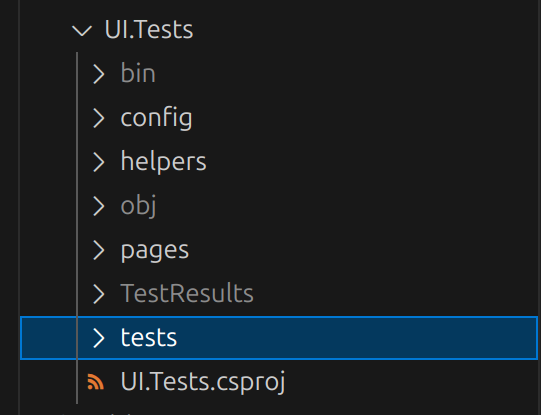
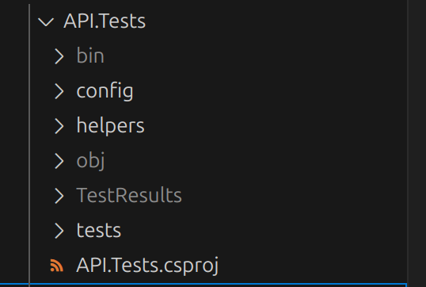
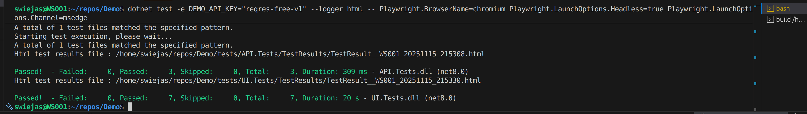
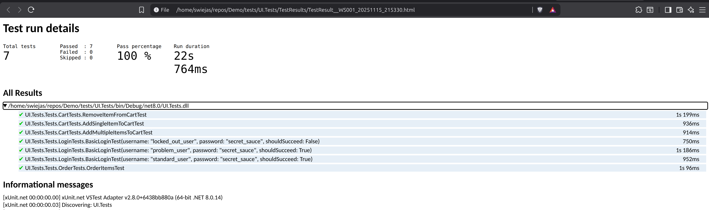
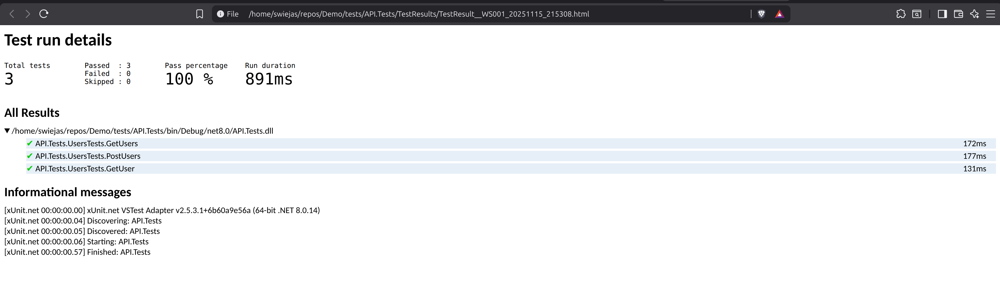

# Projekt Demo
Ten projekt zawiera przykładową implementację testów API oraz testów UI. Testy UI zrealizowane w oparciu o POM.

# Tech Stack

## UI Tests
- net8.0
- Playwright
- XUnit
- Microsoft.Extensions.Configuration

## API Tests
- net8.0
- RestSharp
- XUnit
- Microsoft.Extensions.Configuration

# Uruchamianie
## Tryb headless
```
dotnet test -e DEMO_API_KEY="reqres-free-v1" --logger html -- Playwright.BrowserName=chromium Playwright.LaunchOptions.Headless=true Playwright.LaunchOptions.Channel=msedge
```

## Tryb Headed
```
dotnet test -e DEMO_API_KEY="reqres-free-v1" --logger html -- Playwright.BrowserName=chromium Playwright.LaunchOptions.Headless=false Playwright.LaunchOptions.Channel=msedge
```


# Struktura repozytorium
Repozytorium zawiera jedną solucję oraz 2 projekty: Demo.sln oraz UI.Tests.csproj i API.Tests.csproj.

## Struktura UI.Tests


- config: zawiera appsettings.json z testowaną domeną, oraz credentials.json z kombinacjami danych dostępowych;
- helpers:
    - AuthHelper.cs: pozwala na symulację logowania z pominięciem frontendu. Przyspiesza wykonanie testów innych niż testy logowania;
    - Configuration.cs: pozwala na ładowanie konfiguracji;
    - CookieHelper.cs: używany przez AuthHelper.cs, pozwala na dodać ciasteczka autoryzującego;
    - Credentials.cs: klasa odzwierciedlająca dane logowania z credentials.json. Używana do generowania przypadków testowych dla testów logowania. 

- pages: zawiera modele stron. BasePage.cs służy do realizacji zasady DRY;
- tests: zawiera testy. TestBase.cs służy do realizacji zasady DRY;

## Struktura API.Tests

- config: zawiera appsettings.json z testowaną domeną
- helpers: 
    - Configuration.cs: pozwala na ładowanie konfiguracji;
    - Endpoints.cs: zawiera definicje endpointów. customEndpoints dodane dla przykładu.
    - User.cs: klasa odzwierciedlająca użytkownika przekazywanego/otrzymywanego do/z api
    - tests: zawiera testy.


# Rezultaty


## UI.Tests


## API.Tests

    


